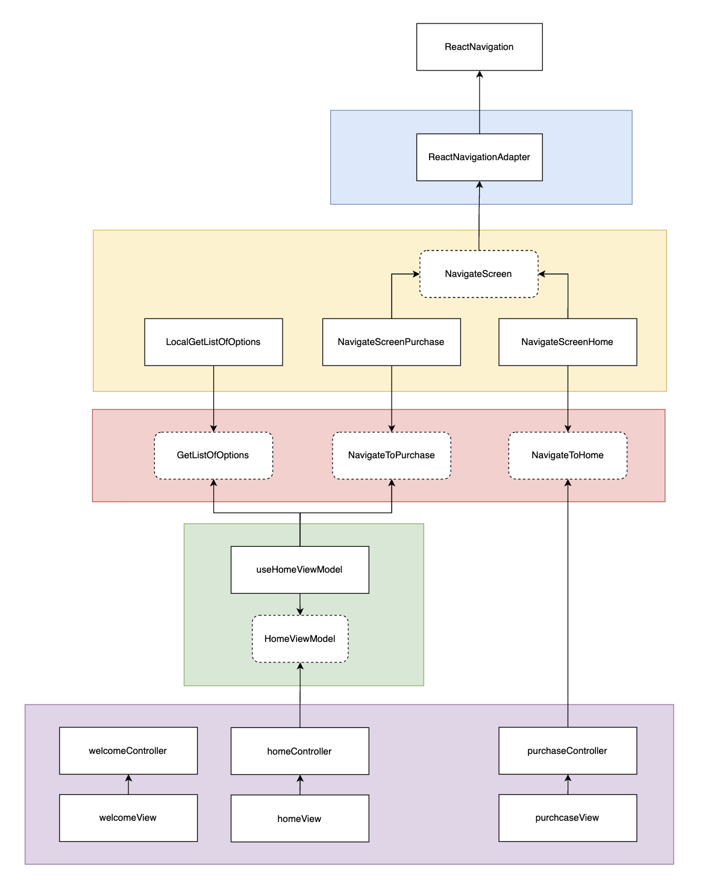

# The Coffee Animation

## Buscando cada vez mais bons testes unitários utilizando o TDD (Test-Driven Development) e baseando-se no repositorio [mvvm-with-react-native](https://github.com/ismaelsousa/mvvm-with-react-native), onde utiliza o padrão arquitetura MVVM. Decidi criar esse projeto inspirado no aplicativo do The Coffee, com uma pitada de animação.

### Objetivos principais a serem alcançados com esse projeto:
- Testes unitários limpos (sem errors, warnings etc.)
- Testes de UI limpos (sem errors, warnings etc.)
- Experimentar o padrão arquitetural MVVM com Arquitetura Limpa

### Um pouco mais sobre a abordagem utilizada
Algo que me incomodava durante as escritas de testes automatizados no React Native, eram os errors e warnings. Depois de um bom tempo trabalhando com React Native, posso dizer com segurança que são poucos os projetos que possuem testes sem alertas. Isso, muito devido a forma como o desenvolvedor escreveu os testes, ou, a abordagem arquitetural adotada. 

Testes automatizados e Arquitetura estão quase que diretamente relacionados, para se ter bons testes, é preciso uma arquitetura desacoplada. Pensando nisso, criei esse projeto com o foco principal em escrever testes sem alertas de errors etc. Para isso, devemos seguir um principio basico do desenvolvimento. Separar responsabilidades.

Segue diagrama arquitetural:



### Build

Agora o grand finale, na raiz do projeto, rode o seguinte comando:

```bash
yarn
```

Após isso, dependendo da plataforma que você deseja rodar a aplicação, execute:

```bash
yarn android
```

ou

```bash
yarn ios
```

### Contact

Para entrar em contato comigo:
- Instagram: [@marlonbelomarques](https://www.instagram.com/marlonbelomarques)
- Linkedin: [Marlon Marques](https://www.linkedin.com/in/marlon-marques-0b509813b/)
- Twitter: [@marlo_marq](https://twitter.com/marlo_marq)
